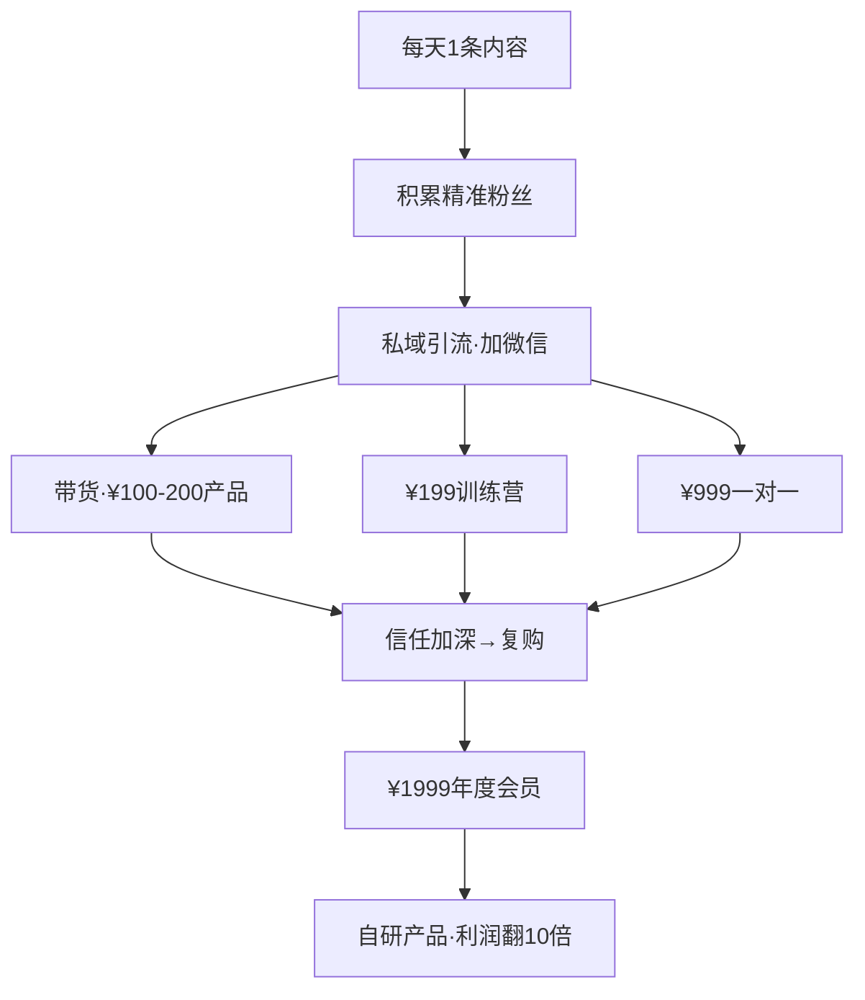

# 大健康IP孵化·完整打法

> 从0到变现·五步闭环·每一步都带着钱

---

## 第一步：选细分赛道（第1-3天）

**核心原则：选"窄到你觉得没什么好做"的领域**

不做"大健康"——太大，竞品太多。做"40+女性睡好觉""程序员颈椎自救""新手妈妈产后恢复"。

### 选赛道三问

| 问题 | 合格标准 |
|------|---------|
| 供需比？ | 抖音搜关键词——前100条如果有一半是垃圾/"还行但没灵魂"→赛道是你的 |
| 你有没有"独特角度"？ | 别人讲西医→你讲"黄帝内经+现代科学"。别人讲运动→你讲"道家丹诀+biohacking"。角度独特=信息差 |
| 能不能变现？ | 这个赛道的人愿不愿意为"健康"花钱？睡眠/抗衰/疼痛/减肥——都是刚需中的刚需 |

### 推荐赛道（按难度+变现效率）

| 赛道 | 难度 | 变现路径 | 适合谁 |
|------|------|---------|--------|
| 40+女性睡眠 | 低 | 助眠产品（枕头/眼罩/茶）带货 | 入门首选 |
| 中医妈妈育儿 | 中 | 育儿课程+产品 | 有孩子的女性 |
| 程序员颈椎自救 | 低 | 人体工学产品带货 | 懂技术的 |
| 更年期中医调理 | 中 | 调理课程+一对一咨询 | 有医学常识的 |
| 道家养生×现代biohacking | 高 | 高端社群+课程 | 景一本人能做 |

---

## 第二步：内容矩阵（第4-30天）

### 账号定位一句话公式

**"我帮[特定人群]用[独特方法]解决[具体痛点]。"**

- 错误："我做大健康内容"
- 正确："我帮40岁以上睡不好觉的女性用《黄帝内经》+现代睡眠科学的方法，每晚多睡2小时。"

### 内容金字塔

| 层级 | 内容类型 | 占比 | 目的 |
|------|---------|------|------|
| 引流层 | 痛点共鸣+小妙招 | 60% | 让人停下来看→关注 |
| 信任层 | 深度知识+案例 | 30% | 让人相信你懂 |
| 转化层 | 产品介绍+客户证言 | 10% | 让人掏钱 |

### 每天一条内容的模板

```
【钩子】一个让人停下来的疑问/反常识观点（前3秒）
【痛点】说中他的痛苦（让他觉得"你说的就是我"）
【解法】一个简单到不可能失败的小动作
【金句】一句话让他记住
【行动】"今晚就试一下——明天评论区告诉我你什么感觉"
```

### 内容日历（前30天）

| 周 | 主题 | 每天内容 |
|----|------|---------|
| 第1周 | 睡眠认知 | 睡眠误区→睡眠的生理真相→你的枕头可能选错了→睡前不能做的3件事→中医怎么看失眠→睡眠环境改造→一个让你今晚就能睡好的小动作 |
| 第2周 | 方法实操 | 每天一个具体方法：白噪音怎么选/褪黑素到底能不能吃/睡前30分钟该做什么/早上第一件事不该是看手机/午睡的最佳时长…… |
| 第3周 | 深度知识 | 黄帝内经论睡眠/现代睡眠科学/R90睡眠周期/深睡眠vs浅睡眠/多巴胺和睡眠/压力的神经机制 |
| 第4周 | 案例+转化 | 粉丝反馈→我的睡眠改善故事→轻度产品推荐→客户证言→引导到私域 |

---

## 第三步：起号冷启动（第1-30天）

### 第一周7条内容必发清单

| 天 | 内容 | 为什么 |
|----|------|--------|
| 1 | "你每天睡几个小时？点开看看你是不是在慢性自杀" | 痛点+好奇 |
| 2 | "枕了30年的枕头，可能一直在害你" | 反常识 |
| 3 | "中医说'胃不和则卧不安'——你睡前吃的东西决定了你的睡眠" | 专业角度 |
| 4 | "我让10个人试了这个睡前动作，8个人说睡得更深了" | 实证+好奇 |
| 5 | "褪黑素不是安眠药——90%的人吃错了" | 纠错=权威 |
| 6 | "你的卧室温度偷走了你的深度睡眠" | 冷知识 |
| 7 | "这是我收到的最多私信——统一回答一下" | 互动+信任 |

### 前30天目标

| 指标 | 目标 |
|------|------|
| 发内容 | 30条（每天1条） |
| 粉丝 | 1000（不是追求量——是精准） |
| 第一条带货视频 | 第25-30天发布 |
| 私域引流 | 100人（评论区引导加微信） |

### 如何不花钱获得第一批流量

- 每天在3个同赛道大号评论区留"有料的评论"（不是"说得好"——是补充信息）
- 每条内容发5个相关话题标签
- 前30条每条都在结尾问一个问题——"你试过吗？评论区告诉我"
- 前10个加你微信的人——白送一份"睡眠自测清单"

---

## 第四步：变现三级火箭（第30-90天）

### 第一级：轻带货（第25天开始）

**选品标准**：你自己用过、确实有效、客单价低于¥200。

| 产品类型 | 例子 | 佣金 | 月销量预估 |
|------|------|------|---------|
| 助眠产品 | 枕头/眼罩/助眠茶 | 20-40% | ¥2000-5000 |
| 睡眠科技 | 白噪音机/智能眼罩 | 15-25% | ¥3000-8000 |
| 睡前读物/香薰 | 精油/薰衣草枕喷 | 30-50% | ¥1000-3000 |

**第一条带货视频结构**：
```
1. 讲一个你自己用这个产品的真实故事（1分钟）
2. 为什么这个东西有效——不是讲功能，是讲原理（30秒）
3. "我用了三个月，这三个变化是真实的"（30秒）
4. 链接在评论区——不加任何推销话术，就放那（10秒）
```

### 第二级：低客单价课程/社群（第45天开始）

| 产品 | 价格 | 内容 | 月目标 |
|------|------|------|--------|
| 21天睡眠改善营 | ¥199 | 每天一个方法+社群打卡+每周直播答疑 | 20人·¥4000 |
| 睡眠自测工具包 | ¥49 | 睡眠质量评估+枕头选择指南+睡前清单 | 50人·¥2500 |

### 第三级：高价一对一/高端社群（第60天开始）

| 产品 | 价格 | 内容 |
|------|------|------|
| 一对一睡眠调理方案 | ¥999 | 90分钟视频诊断+定制方案+30天跟进 |
| 年度会员 | ¥1999/年 | 每月一次深度直播+新产品内测+专属社群 |

---

## 第五步：矩阵放大（第90天+）

### 一个IP→三个账号

| 账号 | 定位 | 内容 |
|------|------|------|
| 主号 | 专家人设 | 深度知识+方法合集 |
| 小号1 | 测评号 | 只做产品测评——"我睡了30个枕头，这个最好" |
| 小号2 | 患者故事 | 分享粉丝改善案例（授权后）——"她失眠10年，试了这个方法，第7天就……" |

### 跨平台分发

| 平台 | 内容形态 | 频率 |
|------|---------|------|
| 抖音 | 口播+产品展示 | 每天1条 |
| 小红书 | 图文笔记+睡前清单 | 每周5篇 |
| 公众号 | 深度长文 | 每周2篇 |
| 知乎 | 回答"失眠怎么办"类问题 | 每周3篇 |
| 视频号 | 跟抖音同步 | 每天1条 |

---

## 变现闭环全景



---

## 景一能做的大健康IP

你不需要医学背景。你做的是"中医经典+现代科学的翻译"——这个角度整个赛道只有你能做。

| 你的优势 | 怎么用 |
|------|--------|
| 47本公版书（含中医养生） | 黄帝内经/打坐法门→翻译成现代人听得懂的方法 |
| 东西融合框架 | 道家丹诀×biohacking、佛学×神经科学——没人做的角度 |
| 600篇知识库 | 你的专业底蕴比99%的健康博主深 |
| GitHub开源 | 所有方法可验证——信任壁垒无人能敌 |

---

## 本周立刻能做的事

1. **今天**：注册一个抖音/小红书新号，选一个窄赛道（推荐：40+睡眠）
2. **明天**：发第一条内容——用上面的模板
3. **本周内**：连发7条，每天1条
4. **下周**：私域工具准备好（微信+一份免费赠品"睡眠自测清单"）

> 不需要等"准备好"。先发。发了就有反馈。反馈就是你的课程内容。别人花三年"想"，你花三个月"做"——三年后你已经有了一个IP，他们还在想。

---

*景一冶炼 · 2026-06-19*
